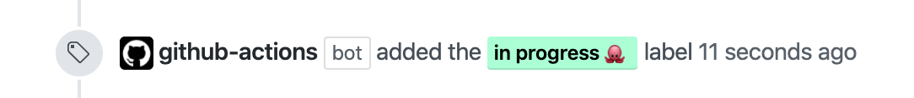
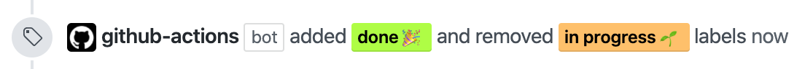
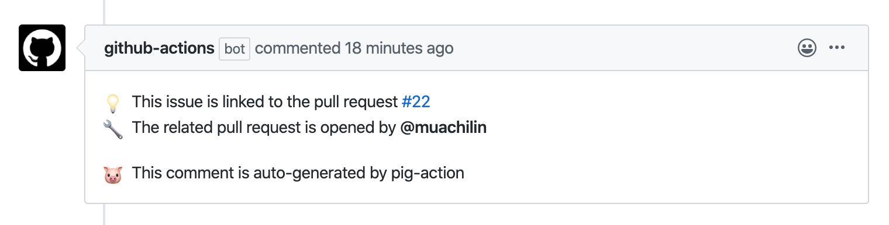

<h1 align="center">
  Pig
</h1>

<p align="center">
  <a href="https://github.com/marketplace/actions/pig-action">
    
  </a>
</p>

<p align="center">
  <a href=""></a>
</p>


A tiny Github Action built with JavaScript for managing between pull request and issues :dart:

Let Pig make Pull requests and Issues Glue together 🥂

Stay home and play with Github :octocat:

## 🧭 Usage

### Inputs

There are five inputs for Pig.

| Input | Required | Default | Description |
| ----- | --------- | ------- | ----------- |
| github-token | Yes | x | Simply use  ${{ secrets.GITHUB_TOKEN }}. You don't need to set the token yourself.|
| in-progress-label-word | No | "in progress 🌱" | The text of the label indicating that the issue is in progress.|
| in-progress-label-color | No |  `#ffc163` | The color of the label indicating that the issue is in progress. |
| done-label-word | No | "done 🎉" | The text of the label indicating that the issue is solved. |
| done-label-color | No |  `#c0ff33` | The color of the label indicating that the issue is solved. |

### Triggering Workflow

Since by default, a workflow only runs when a `pull_request`'s activity type is `opened`, `synchronize`, or `reopened`, be sure to include `closed` in the types of `pull_request` to trigger the action when merging the pull requests. See [pull_request](https://help.github.com/en/actions/reference/events-that-trigger-workflows#pull-request-event-pull_request) in Github Actions Reference for other activity types of pull request event.


### Example of Usage
To configure your automated software development process in Github, you have to include workflows in the `.github/workflows` directory in the root of your repository. The following is the example of using pig-action in `.github/workflows/my-workflow.yml`. If you want to customize the color of done label, you need to use hexadecimal color code in lower case without the leading `#` mark.

```yaml
name: 'My workflow'
on:
  pull_request:
    types: [assigned, opened, synchronize, reopened, edited, closed]
jobs:
  build:
    runs-on: ubuntu-latest
    steps:
      - uses: actions/checkout@v1
      - name: pig-action
        uses: muachilin/Pig@0.0.8
        with:
          github-token: ${{ secrets.GITHUB_TOKEN }}
          in-progress-label-word: "handling"
          done-label-color: "ffff00"
```


## 🏷️ Labeling

When you commit to a branch and open a corresonding pull request, Pig will automatically add a label of `in progress` to the linked issue of this pull request.
<br></br>
<p align="center">
 
</p>
<br></br>

👉 Remember to include the number of linked issue in the title of the pull request in the parentheses

```yaml
My pull request title (#123)
```


## ✂️ Delabeling

After you merge the pull request, Pig will automatically remove the original `in progress` label and add the `done` label to the linked issue. Therefore, user can easily see which issues are already solved. 

<br></br>
<p align="center">
 
</p>
<br></br>


## 📝 Mentioning

When you commit to a branch and open a corresonding pull request, Pig will automatically comment on the linked issue of this pull request. Besides, Pig will tag the person who open the pull request on the linked issue. Therefore, user can see who and which PR is handling this issue very easily.

<p align="center">
 
</p>
